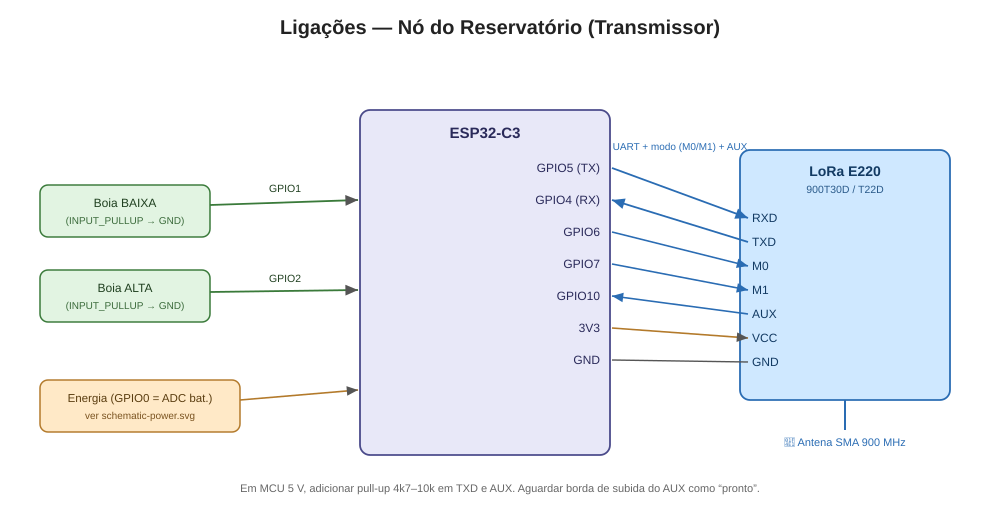
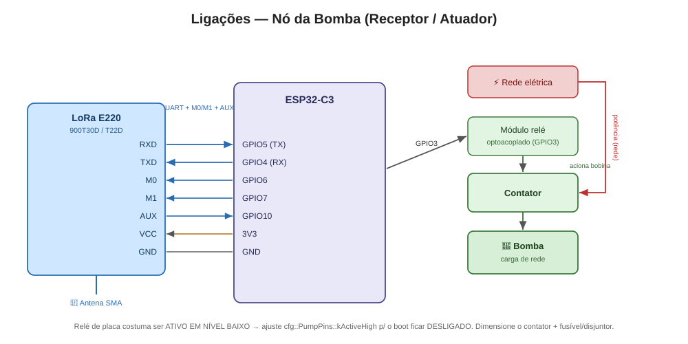

# Controle de Bomba D'água à Distância — ESP32-C3 + LoRa

Sistema de controle remoto de bomba d'água com dois nós sem fio de longo
alcance (até ~5 km), baseado em **ESP32-C3** e módulos **LoRa EBYTE E220**
(900 MHz). O nó do reservatório mede o nível da caixa d'água e comanda, via
LoRa, o nó da bomba na captação — com confirmação (ACK), retransmissão e
**failsafe de segurança** (a bomba desliga se o enlace cair).


> **Status do projeto:** 🟡 `v0.0.1` (estruturação, pré-alpha) — esqueleto
> funcional. Arquitetura, protocolo e drivers principais implementados. Pinagem
> e modelo exato dos módulos ainda precisam ser confirmados no hardware —
> procure por `TODO(hw)` no código. Histórico em [`CHANGELOG.md`](CHANGELOG.md).
>
> A branch `feature/prototipo-bancada` roda em **modo bancada**: ver
> [Protótipo de bancada](#protótipo-de-bancada).

---

## Sumário

- [Visão geral](#visão-geral)
- [Hardware necessário](#hardware-necessário)
- [Estrutura do repositório](#estrutura-do-repositório)
- [Como compilar e gravar](#como-compilar-e-gravar)
- [Protótipo de bancada](#protótipo-de-bancada)
- [Configuração](#configuração)
- [Protocolo de comunicação](#protocolo-de-comunicação)
- [Documentação adicional](#documentação-adicional)
- [Pendências (TODOs de hardware)](#pendências-todos-de-hardware)

---

## Visão geral

| Nó | Papel | Componentes | Seleção |
|----|-------|-------------|---------|
| **Reservatório** | Transmissor | ESP32-C3, boia de nível, E220 | strap aberto |
| **Bomba** | Receptor / atuador | ESP32-C3, relé/contator, E220 | strap no GND |

**Lógica de controle (com histerese das boias):**

- Caixa **baixa** → comando **LIGAR** bomba (encher).
- Caixa **cheia** → comando **DESLIGAR** bomba.
- Nível intermediário → mantém o comando anterior (evita liga-desliga rápido).
- Falha de sensor **ou perda de enlace** → bomba **DESLIGADA** (seguro).

## Hardware necessário

- 2× **ESP32-C3** (RISC-V, Wi-Fi + BLE, baixo consumo).
- 2× módulo LoRa **EBYTE E220-900T30D** (30 dBm / 1 W) **ou** **E220-900T22D**
  (22 dBm / 160 mW) — o firmware suporta ambos (só muda a tabela de potência).
  > ⚠️ Os E220 são **UART/TTL**, não SPI. A camada HAL abstrai isso; um driver
  > SPI SX1276/RFM95 existe como **segunda estratégia** (esqueleto).
- Sensor de nível: **boia** (padrão) — 1 ou 2 boias para histerese.
  Ultrassônico é **opcional** (flag `USE_ULTRASONIC_SENSOR`).
- 1× **relé/contator** dimensionado para a bomba (no nó da bomba).
- Alimentação **dual com failover** por nó:
  - Fonte externa (adaptador 5 V / 12 V) **+**
  - Bateria de lítio 18650 com carregador/proteção (**TP4056** ou similar);
  - Chaveamento automático fonte↔bateria (ideal-diode/diodos);
  - Monitor de tensão/corrente (ADC via divisor, ou **INA219/INA226** por I2C).
- Antenas SMA adequadas à faixa 900 MHz (ganho ~2–3 dBi).

### Ligações dos nós

| Reservatório (transmissor) | Bomba (receptor/atuador) |
|:--------------------------:|:------------------------:|
|  |  |

> Esquemático completo, pinagem detalhada e notas de projeto:
> [`assets/schematic.md`](assets/schematic.md).

## Estrutura do repositório

```
lora-water-pump-control/
├── CMakeLists.txt              # projeto ESP-IDF
├── sdkconfig.defaults          # alvo esp32c3 + opções do projeto
├── README.md
├── CHANGELOG.md                # histórico de versões (SemVer)
├── docs/
│   ├── ARCHITECTURE.md         # decisões, camadas, protocolo, máquinas de estado
│   ├── context/                # notas de contexto (decisões, hardware, status)
│   └── datasheets/             # manuais dos módulos E220
├── assets/
│   ├── block-diagram.md/.svg   # diagrama de blocos da solução
│   ├── schematic.md            # esquemático elétrico (imagens + Mermaid + texto)
│   ├── schematic-power.svg     # subsistema de energia (failover + TP4056)
│   ├── schematic-reservoir.svg # ligações do nó do reservatório
│   └── schematic-pump.svg      # ligações do nó da bomba
├── components/                 # código compartilhado, em camadas
│   ├── config/                 # pinos, endereços, timeouts, perfil de RF
│   ├── platform/               # relógio monotônico (isola o ESP-IDF)
│   ├── hw/                     # abstração de hardware (interfaces + drivers)
│   ├── protocol/               # pacote, CRC, camada de enlace (ACK/retry)
│   ├── core/                   # máquinas de estado + Observer
│   └── power/                  # deep sleep + failover de energia
└── main/
    ├── main.cpp                # lê o strap e assume o papel do nó
    ├── reservoir_app.cpp       # laço do nó do reservatório
    └── pump_app.cpp            # laço do nó da bomba
```

As dependências entre camadas são declaradas em `REQUIRES`, no `CMakeLists.txt`
de cada componente — o build **impede** que `core/` ou `protocol/` alcancem um
driver concreto.

## Como compilar e gravar

O projeto é compilado e gravado pela **extensão ESP-IDF do VS Code**, com o
[ESP-IDF](https://docs.espressif.com/projects/esp-idf/) **v6.1**.

**Um único binário serve aos dois nós.** O papel é lido no boot pelo pino
`cfg::RolePins::kRoleStrap`:

| Strap | Papel |
|-------|-------|
| aberto | reservatório (transmissor) |
| ligado ao GND | bomba (receptor/atuador) |

O aberto virar reservatório é proposital: é o papel que não aciona o relé, então
um strap solto nunca faz um nó assumir o comando da bomba.

### Preparação (uma vez por máquina)

1. Instale a extensão **ESP-IDF** (`espressif.esp-idf-extension`) no VS Code.
2. `Ctrl+Shift+P` → **ESP-IDF: Configure ESP-IDF Extension**. O instalador
   (EIM) baixa o ESP-IDF **v6.1** e as ferramentas (no Windows, em `C:\esp\v6.1`
   e `C:\Espressif`).
3. Abra a pasta do repositório no VS Code.
4. `Ctrl+Shift+P` → **ESP-IDF: Select Current ESP-IDF Version** → **v6.1**.

### Configuração do projeto (uma vez)

Pela barra de status, na parte de baixo da janela, ou pela paleta
(`Ctrl+Shift+P`):

| Ajuste | Comando | Valor |
|--------|---------|-------|
| Alvo | **ESP-IDF: Set Espressif Device Target** | `esp32c3` → *ESP32-C3 chip (via builtin USB-JTAG)* |
| Método de gravação | **ESP-IDF: Select Flash Method** | `UART` |
| Porta | **ESP-IDF: Select Port to Use** | a COM da placa (ex.: `COM3`) |

Trocar o alvo recria o `sdkconfig` a partir do `sdkconfig.defaults`. A porta
aparece no Gerenciador de Dispositivos (o USB Serial/JTAG do C3 costuma se
chamar "Dispositivo serial USB").

### Compilar, gravar e monitorar

| Ação | Atalho | Comando da paleta |
|------|--------|-------------------|
| Compilar | `Ctrl+E B` | ESP-IDF: Build your Project |
| Gravar | `Ctrl+E F` | ESP-IDF: Flash your Project |
| Monitor serial | `Ctrl+E M` | ESP-IDF: Monitor Device |
| **Tudo de uma vez** | `Ctrl+E D` | ESP-IDF: Build, Flash and Start a Monitor on your Device |
| Opções do `sdkconfig` | `Ctrl+E G` | ESP-IDF: SDK Configuration Editor |
| Limpar o build | — | ESP-IDF: Full Clean Project |

Os mesmos botões aparecem na barra de status (chave inglesa = compilar, raio =
gravar, tela = monitor). Para sair do monitor, use `Ctrl+]`.

**Gravando as duas placas:** grave a primeira, troque a porta em *Select Port
to Use* e grave a segunda. O binário é o mesmo. Para ver os dois logs ao mesmo
tempo, abra o segundo monitor em **ESP-IDF: Open ESP-IDF Terminal** com
`idf.py -p COMx monitor`.

Depois de criar, renomear ou apagar um componente, ou de mexer em `REQUIRES`,
rode **Full Clean Project** antes de compilar. O CMake só descobre os
componentes na configuração.

> Pelo terminal (CI, scripts): ative o ambiente com
> `. C:\Espressif\tools\Microsoft.v6.1.PowerShell_profile.ps1` e use
> `idf.py build` / `idf.py -p COMx flash monitor`.

> ⚠️ Os dois nós gravam a configuração do E220 (canal, taxa aérea) a cada boot.
> Ao mudar algo em `RadioConfig.h`, **regrave as duas placas**: em
> configurações diferentes elas não se comunicam, e o sintoma é o mesmo de um
> enlace caído.

## Protótipo de bancada

Primeira etapa de validação: **enlace, protocolo e failsafe na mesa, sem água,
sem bomba e sem carga AC**. É o critério para a versão `0.1.0` (primeiro alpha).
Roteiro completo em [`docs/context/bancada.md`](docs/context/bancada.md).

### O que muda em relação ao campo

| Campo | Bancada | Implementação |
|-------|---------|---------------|
| Boias | **Chave que trava** (gangorra/alavanca) | `BenchSwitchLevelSensor` |
| Contator + bomba | **LED + resistor de 330 Ω** | `RelayPumpActuator` (mesmo driver) |
| Bateria + divisor | **Stub fixo** (fonte externa, 100%) | `StubBatteryMonitor` |
| Tempos de campo | **Tempos curtos** | `BENCH_PROFILE` em `NodeConfig.h` |
| TX a 22 dBm | **TX a 10 dBm** | `cfg::kTxPower` em `RadioConfig.h` |

Controladores, protocolo e `LinkLayer` **não mudam**: só trocam as
implementações de `ILevelSensor` e `IBatteryMonitor`. O `BENCH_PROFILE` vem
ligado. Para os tempos e a potência de campo, troque `#define BENCH_PROFILE 1`
por `0` em `NodeConfig.h`. (`idf.py build -DBENCH_PROFILE=0` **não** funciona:
cria uma variável do CMake, não um `#define` do compilador.)

| | Bancada | Campo |
|---|---|---|
| Ciclo do reservatório | 2 s | 10 s |
| Heartbeat | 5 s | 15 s |
| Failsafe (perda de enlace) | 15 s | 45 s |
| Telemetria de bateria | 15 s | 60 s |
| Potência de TX (T22D) | 10 dBm | 22 dBm |

### Material

- 2× devkit ESP32-C3 e 2× **E220-900T22D**, cada módulo com a **sua antena**
  de 900 MHz.
- 2× protoboard, jumpers e 2 cabos USB de dados.
- 1× chave que trava (não serve botão momentâneo: a leitura é uma vez por
  ciclo).
- 1× LED + resistor de 330 Ω.
- Recomendado: 100 µF + 100 nF junto ao VCC de cada E220.

### Ligações

As duas placas recebem **o mesmo binário**; só o strap muda.

| Função | GPIO do ESP32-C3 | Ligação |
|--------|------------------|---------|
| E220 `TXD` | 4 (RX do ESP) | |
| E220 `RXD` | 5 (TX do ESP) | |
| E220 `M0` / `M1` | 6 / 7 | |
| E220 `AUX` | 10 | |
| E220 `VCC` / `GND` | 3V3 / GND | |
| Strap de papel | 3 | aberto = reservatório · GND = bomba |
| Chave de nível (só reservatório) | 1 | outro lado no GND |
| LED (só bomba) | 0 | LED + 330 Ω para o GND |

### Antes de energizar

- **Nunca ligue um E220 sem antena.** O firmware transmite logo no boot, e sem
  carga a potência refletida pode danificar o PA.
- **Mantenha ≥ 1 m entre as antenas.** Mesmo a 10 dBm, módulos colados saturam
  o receptor e geram erros de CRC que não vêm do protocolo.
- **Canal 55 (905,125 MHz)**, dentro da faixa permitida pela ANATEL. O canal de
  fábrica do E220 (873,125 MHz) não é permitido no Brasil. Detalhes em
  [`docs/context/hardware.md`](docs/context/hardware.md).

### Roteiro de validação

1. **Boot:** cada nó loga o papel que assumiu.
2. **Rádio:** nenhum nó pode logar `FALHA ao iniciar o radio E220`.
3. **Liga:** feche a chave; em ~2 s o LED acende (`estado -> BOMBEANDO`).
4. **Desliga:** abra a chave; o LED apaga (`OCIOSO`).
5. **Failsafe:** com o LED aceso, desligue o reservatório. Em ~15 s o LED deve
   apagar sozinho (`ENLACE PERDIDO (failsafe)`). **É o teste que mais importa.**
6. **Recuperação:** religue o reservatório; o enlace volta e o LED reacende.

### O que a bancada não prova

- Alcance e margem de enlace (o teste de campo é outro).
- Comportamento com a carga AC real: surto do contator, transientes e ruído.
- Consumo e autonomia em bateria.
- Comportamento das boias reais.

## Configuração

Toda a configuração fica em [`components/config/include/config/`](components/config/include/config):

| Arquivo | O que define |
|---------|--------------|
| `PinConfig.h` | Pinos físicos (strap de papel, UART do E220, M0/M1/AUX, boias, relé, ADC, I2C). |
| `NodeConfig.h` | Endereços lógicos dos nós, timeouts, retries, deep sleep. |
| `RadioConfig.h` | Canal, taxa aérea, potência, variante do E220 (T30D/T22D). |

**Sensor de nível:** o alvo de campo é a **boia** (`FloatSwitchLevelSensor`), e o
ultrassônico é opcional. O protótipo de bancada usa uma **chave manual**
(`BenchSwitchLevelSensor`) — ver [Protótipo de bancada](#protótipo-de-bancada).

## Protocolo de comunicação

Protocolo próprio, ponto-a-ponto, com quadro de 8 bytes de cabeçalho + payload
+ CRC-16. Tipos: `STATUS_NIVEL`, `COMANDO_BOMBA`, `ACK`, `HEARTBEAT`,
`BATERIA_STATUS`. Detalhes (layout de bits, ACK/retry, failsafe) em
[`docs/ARCHITECTURE.md`](docs/ARCHITECTURE.md#protocolo-de-comunicação).

## Documentação adicional

- **Histórico de versões:** [`CHANGELOG.md`](CHANGELOG.md)
- **Arquitetura e decisões:** [`docs/ARCHITECTURE.md`](docs/ARCHITECTURE.md)
- **Diagrama de blocos:** [`assets/block-diagram.md`](assets/block-diagram.md)
- **Esquemático elétrico:** [`assets/schematic.md`](assets/schematic.md) — energia
  ([SVG](assets/schematic-power.svg)), reservatório
  ([SVG](assets/schematic-reservoir.svg)) e bomba
  ([SVG](assets/schematic-pump.svg))

## Pendências (TODOs de hardware)

Decisões que dependem do hardware final estão marcadas com `TODO(hw)` no código:

- [ ] Pinagem exata do ESP32-C3 (UART, M0/M1/AUX, relé, boias, ADC, I2C).
- [ ] Modelo do módulo por nó: **E220-900T30D** ou **E220-900T22D**.
- [ ] Nível lógico do módulo relé (ativo alto/baixo) e da(s) boia(s).
- [ ] Razão do divisor resistivo do ADC de bateria (ou adoção do INA219/226).
- [ ] Habilitar/validar o deep sleep e a chave de acordar por evento.
