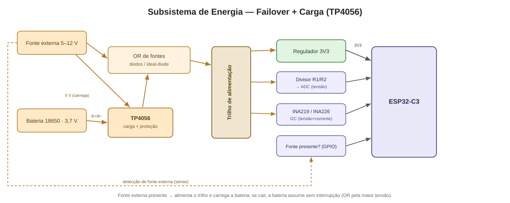

# Controle de Bomba D'água à Distância — ESP32-C3 + LoRa

Sistema de controle remoto de bomba d'água com dois nós sem fio de longo
alcance (até ~5 km), baseado em **ESP32-C3** e módulos **LoRa EBYTE E220**
(900 MHz). O nó do reservatório mede o nível da caixa d'água e comanda, via
LoRa, o nó da bomba na captação — com confirmação (ACK), retransmissão e
**failsafe de segurança** (a bomba desliga se o enlace cair).


> **Status do projeto:** 🟡 Esqueleto funcional. Arquitetura, protocolo e
> drivers principais implementados. Pinagem e modelo exato dos módulos ainda
> precisam ser confirmados no hardware — procure por `TODO(hw)` no código.

---

## Sumário

- [Visão geral](#visão-geral)
- [Hardware necessário](#hardware-necessário)
- [Estrutura do repositório](#estrutura-do-repositório)
- [Como compilar e gravar](#como-compilar-e-gravar)
- [Configuração](#configuração)
- [Protocolo de comunicação](#protocolo-de-comunicação)
- [Documentação adicional](#documentação-adicional)
- [Pendências (TODOs de hardware)](#pendências-todos-de-hardware)

---

## Visão geral

| Nó | Papel | Componentes | Ambiente de build |
|----|-------|-------------|-------------------|
| **Reservatório** | Transmissor | ESP32-C3, boia de nível, E220 | `reservoir_node` |
| **Bomba** | Receptor / atuador | ESP32-C3, relé/contator, E220 | `pump_node` |

**Lógica de controle (com histerese das boias):**

- Caixa **baixa** → comando **LIGAR** bomba (encher).
- Caixa **cheia** → comando **DESLIGAR** bomba.
- Nível intermediário → mantém o comando anterior (evita liga-desliga rápido).
- Falha de sensor **ou perda de enlace** → bomba **DESLIGADA** (seguro).

## Hardware necessário

- 2× **ESP32-C3** (RISC-V, Wi-Fi + BLE, baixo consumo).
- 2× módulo LoRa **EBYTE E220-900T30D** (30 dBm / 1 W) **ou** **E220-900T22D**
  (22 dBm / 160 mW) — o firmware suporta ambos (só muda a tabela de potência).
  > ⚠️ Os E220 são **UART/TTL**, não SPI. A camada HAL abstrai isso; um driver
  > SPI SX1276/RFM95 existe como **segunda estratégia** (esqueleto).
- Sensor de nível: **boia** (padrão) — 1 ou 2 boias para histerese.
  Ultrassônico é **opcional** (flag `USE_ULTRASONIC_SENSOR`).
- 1× **relé/contator** dimensionado para a bomba (no nó da bomba).
- Alimentação **dual com failover** por nó:
  - Fonte externa (adaptador 5 V / 12 V) **+**
  - Bateria de lítio 18650 com carregador/proteção (**TP4056** ou similar);
  - Chaveamento automático fonte↔bateria (ideal-diode/diodos);
  - Monitor de tensão/corrente (ADC via divisor, ou **INA219/INA226** por I2C).
- Antenas SMA adequadas à faixa 900 MHz (ganho ~2–3 dBi).

### Alimentação — failover fonte/bateria (TP4056)



### Ligações dos nós

| Reservatório (transmissor) | Bomba (receptor/atuador) |
|:--------------------------:|:------------------------:|
|  |  |

> Esquemático completo, pinagem detalhada e notas de projeto:
> [`assets/schematic.md`](assets/schematic.md).

## Estrutura do repositório

```
lora-water-pump-control/
├── platformio.ini              # 2 ambientes: reservoir_node / pump_node
├── README.md
├── docs/
│   └── ARCHITECTURE.md         # decisões, camadas, protocolo, máquinas de estado
├── assets/
│   ├── block-diagram.md/.svg   # diagrama de blocos da solução
│   ├── schematic.md            # esquemático elétrico (imagens + Mermaid + texto)
│   ├── schematic-power.svg     # subsistema de energia (failover + TP4056)
│   ├── schematic-reservoir.svg # ligações do nó do reservatório
│   └── schematic-pump.svg      # ligações do nó da bomba
├── lib/                        # código compartilhado, em camadas
│   ├── config/                 # pinos, endereços, timeouts, perfil de RF
│   ├── hal/                    # abstração de hardware (interfaces + drivers)
│   ├── protocol/               # pacote, CRC, camada de enlace (ACK/retry)
│   ├── core/                   # máquinas de estado + Observer
│   └── power/                  # deep sleep + failover de energia
└── src/
    ├── reservoir_node/main.cpp # firmware do nó do reservatório
    └── pump_node/main.cpp      # firmware do nó da bomba
```

## Como compilar e gravar

Requisitos: [PlatformIO](https://platformio.org/) (CLI ou extensão do VS Code).

```bash
# Compilar ambos os nós
pio run

# Gravar o nó do reservatório (transmissor)
pio run -e reservoir_node -t upload

# Gravar o nó da bomba (receptor) e abrir o monitor serial
pio run -e pump_node -t upload -t monitor
```

## Configuração

Toda a configuração fica em [`lib/config/`](lib/config):

| Arquivo | O que define |
|---------|--------------|
| `PinConfig.h` | Pinos físicos (UART do E220, M0/M1/AUX, boias, relé, ADC, I2C). |
| `NodeConfig.h` | Endereços lógicos dos nós, timeouts, retries, deep sleep. |
| `RadioConfig.h` | Canal, taxa aérea, potência, variante do E220 (T30D/T22D). |

**Sensor de nível:** a **boia** é o padrão. Para usar o ultrassônico (opcional),
descomente `-D USE_ULTRASONIC_SENSOR=1` no ambiente `reservoir_node` do
`platformio.ini`.

## Protocolo de comunicação

Protocolo próprio, ponto-a-ponto, com quadro de 8 bytes de cabeçalho + payload
+ CRC-16. Tipos: `STATUS_NIVEL`, `COMANDO_BOMBA`, `ACK`, `HEARTBEAT`,
`BATERIA_STATUS`. Detalhes (layout de bits, ACK/retry, failsafe) em
[`docs/ARCHITECTURE.md`](docs/ARCHITECTURE.md#protocolo-de-comunicação).

## Documentação adicional

- **Arquitetura e decisões:** [`docs/ARCHITECTURE.md`](docs/ARCHITECTURE.md)
- **Diagrama de blocos:** [`assets/block-diagram.md`](assets/block-diagram.md)
- **Esquemático elétrico:** [`assets/schematic.md`](assets/schematic.md) — energia
  ([SVG](assets/schematic-power.svg)), reservatório
  ([SVG](assets/schematic-reservoir.svg)) e bomba
  ([SVG](assets/schematic-pump.svg))

## Pendências (TODOs de hardware)

Decisões que dependem do hardware final estão marcadas com `TODO(hw)` no código:

- [ ] Pinagem exata do ESP32-C3 (UART, M0/M1/AUX, relé, boias, ADC, I2C).
- [ ] Modelo do módulo por nó: **E220-900T30D** ou **E220-900T22D**.
- [ ] Nível lógico do módulo relé (ativo alto/baixo) e da(s) boia(s).
- [ ] Razão do divisor resistivo do ADC de bateria (ou adoção do INA219/226).
- [ ] Geometria da caixa, caso o sensor ultrassônico seja usado.
- [ ] Habilitar/validar o deep sleep e a chave de acordar por evento.
