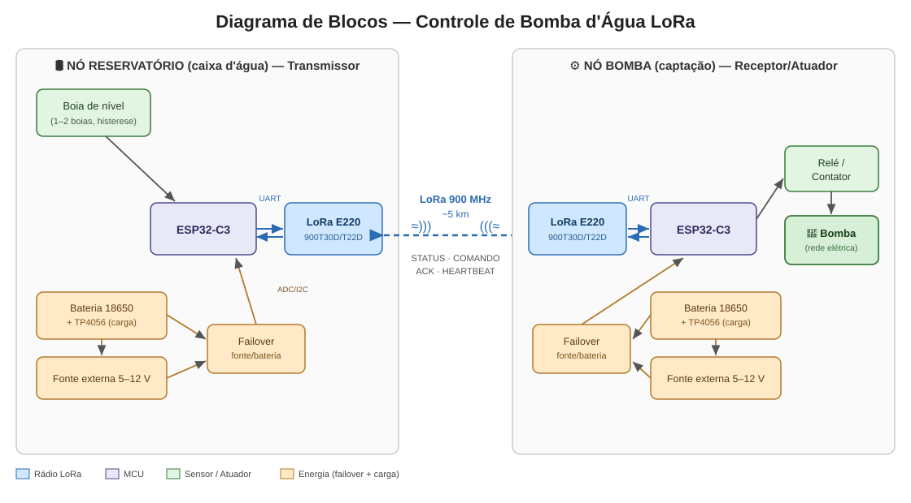
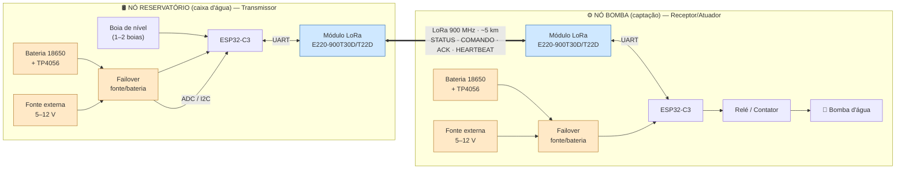

# Diagrama de Blocos da Solução

Visão geral dos dois nós e do enlace LoRa.

> A imagem acima (SVG) abre em qualquer visualizador. O diagrama Mermaid abaixo
> é a **fonte editável** — renderiza automaticamente no GitHub e em editores com
> suporte a Mermaid; em previews sem esse suporte ele aparece como código.

## Fluxo de dados

1. O **reservatório** lê a boia e decide (com histerese) ligar/desligar a bomba.
2. Envia `COMANDO_BOMBA` por LoRa **com ACK**; retransmite se necessário.
3. A **bomba** aplica o comando no relé e responde `ACK`.
4. `HEARTBEAT` periódico mantém o enlace vivo; sua ausência aciona o **failsafe**
   (bomba desliga).
5. `BATERIA_STATUS` reporta tensão/corrente/estado de carga.

> Para o esquemático elétrico detalhado (TP4056, chaveamento, INA219, pinos),
> ver [`schematic.md`](schematic.md).
