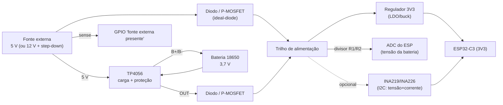
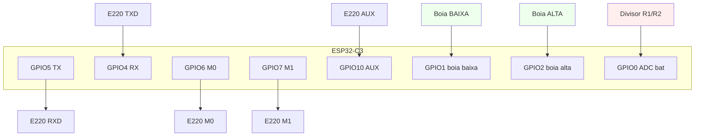
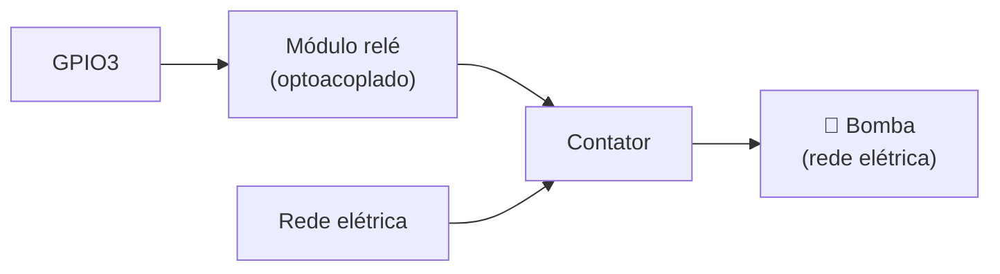

# Esquemático Elétrico (básico)

Descrição textual + diagramas das ligações de cada nó. Os pinos do ESP32-C3 são
**provisórios** e devem casar com [`lib/config/PinConfig.h`](../lib/config/PinConfig.h)
(procure `TODO(hw)`).

> ⚠️ **Segurança:** a bomba é uma carga de rede/alta corrente. Use relé/contator
> adequadamente dimensionado, com isolação e proteção (fusível/disjuntor). O
> ESP32-C3 nunca chaveia a carga diretamente.

---

## 1. Subsistema de energia (idêntico nos dois nós)

Alimentação dual com **failover automático em hardware** e carregamento de
bateria de lítio via **TP4056** (com proteção DW01+FS8205 nas placas comuns).


<details><summary>Fonte editável (Mermaid)</summary>



</details>

**Princípio do failover:** quando a fonte externa está presente, ela alimenta o
trilho **e** carrega a bateria pelo TP4056; se cair, a bateria assume sem
interrupção (os diodos/ideal-diode dão o *OR* de fontes com a maior tensão).

**Monitoramento (escolha um):**

- **ADC + divisor** (`AdcBatteryMonitor`): simples, só tensão. `R1/R2` definem a
  razão (ex.: 100k/100k → ÷2, ajuste `dividerRatio`).
- **INA219/INA226** (`Ina219BatteryMonitor`): I2C, mede tensão **e** corrente
  (carga/descarga). Preferido; ligar em série na saída da bateria (shunt).

**Detecção de fonte:** `kExternalPresent` (GPIO) lê alto quando o adaptador
está presente — usado para reportar `PowerSource` e decidir dormir.

---

## 2. Nó do RESERVATÓRIO (transmissor)

```
  ESP32-C3                         E220-900T30D/T22D (UART)
  --------                         -------------------------
  GPIO5 (TX) ────────────────────► RXD
  GPIO4 (RX) ◄──────────────────── TXD
  GPIO6      ────────────────────► M0
  GPIO7      ────────────────────► M1
  GPIO10 (IRQ) ◄────────────────── AUX     (pull-up 4k7–10k se MCU 5V)
  3V3        ────────────────────► VCC     (3,0–5,5 V)
  GND        ────────────────────► GND
                                   ANT ──► antena SMA 900 MHz

  Boias (INPUT_PULLUP, fecham para GND):
  GPIO1 ◄── boia BAIXA  ── GND
  GPIO2 ◄── boia ALTA   ── GND

  Energia: ver seção 1 (ADC em GPIO0, 'externa presente' em GPIO18,
           I2C opcional SDA=GPIO8 / SCL=GPIO9).
```


<details><summary>Fonte editável (Mermaid)</summary>



</details>

### Histerese com duas boias

| Boia baixa | Boia alta | Estado | Ação |
|:---------:|:---------:|--------|------|
| aberta | aberta | `kLow` (vazia) | **LIGA** bomba |
| fechada | aberta | `kMid` | mantém |
| fechada | fechada | `kHigh` (cheia) | **DESLIGA** bomba |
| aberta | fechada | inválido | `kUnknown` → **DESLIGA** (seguro) |

> Com **uma** boia só (no topo), use-a como corte de "cheio"; a partida por
> "vazio" fica por tempo/histerese de software. Duas boias são recomendadas.

---

## 3. Nó da BOMBA (receptor/atuador)

```
  ESP32-C3                         E220-900T30D/T22D (UART)
  --------                         -------------------------
  GPIO5 (TX) ────────────────────► RXD
  GPIO4 (RX) ◄──────────────────── TXD
  GPIO6      ────────────────────► M0
  GPIO7      ────────────────────► M1
  GPIO10 (IRQ) ◄────────────────── AUX
  3V3 / GND  ────────────────────► VCC / GND ──► ANT SMA

  Acionamento da bomba:
  GPIO3 ──► IN do módulo relé ──► [relé/contator] ──► BOMBA (rede)
  (ativo alto/baixo conforme cfg::PumpPins::kActiveHigh)

  Energia: ver seção 1.
```


<details><summary>Fonte editável (Mermaid)</summary>



</details>

> O relé de placa costuma ser **ativo em nível baixo**. Ajuste
> `cfg::PumpPins::kActiveHigh` conforme o seu módulo, para que o estado de boot
> (bomba **desligada**) seja respeitado.

---

## 4. Notas de projeto (do datasheet EBYTE)

- **AUX**: aguardar borda de subida como "pronto"; em MCU 5 V, adicionar
  *pull-up* de 4k7–10k em TXD e AUX.
- **Antena**: SMA 900 MHz, exposta e preferencialmente vertical; nunca dentro de
  caixa metálica (atenua muito).
- **Alimentação**: para potência máxima no T30D, VCC ≥ 5 V (pico de TX ~620 mA
  @30 dBm). Dimensione o regulador e a bateria com folga (>30%).
- **LBT** habilitado reduz colisão em ambiente ruidoso (custa latência).
