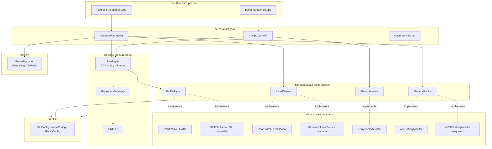
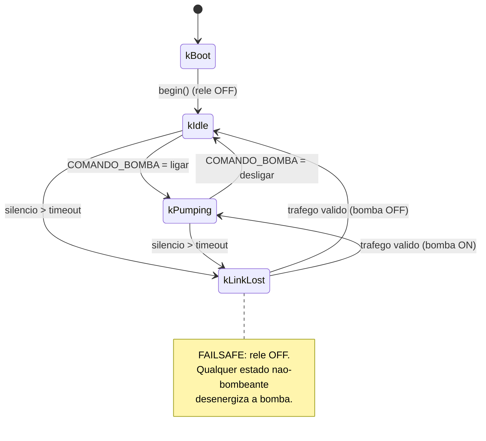
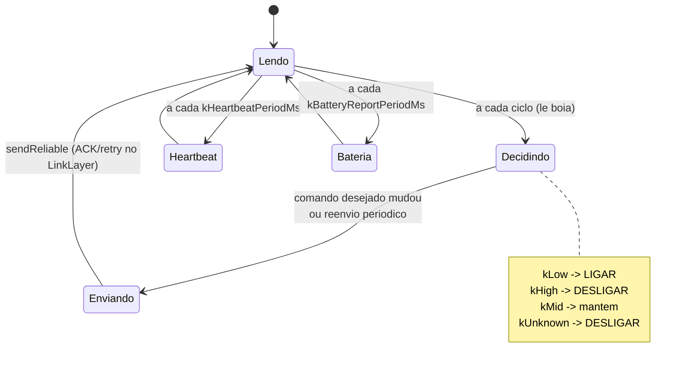

# Arquitetura — Controle de Bomba D'água LoRa

Este documento descreve as decisões arquiteturais, a divisão em camadas, o
protocolo de comunicação e as máquinas de estado dos dois nós.

## Índice

- [Princípios](#princípios)
- [Camadas](#camadas)
- [Padrões de projeto](#padrões-de-projeto)
- [Escolha do transporte: por que o E220 é UART](#escolha-do-transporte-por-que-o-e220-é-uart)
- [Protocolo de comunicação](#protocolo-de-comunicação)
- [Máquinas de estado](#máquinas-de-estado)
- [Gerenciamento de energia](#gerenciamento-de-energia)
- [Failsafe de segurança](#failsafe-de-segurança)

## Princípios

1. **Segurança primeiro.** O estado padrão da bomba é DESLIGADA. Qualquer
   incerteza (sensor falho, enlace perdido, boot) resulta em bomba desligada.
2. **Não bloqueante.** Nenhum `delay()` longo no caminho principal; tudo é
   dirigido por máquinas de estado e por `poll()` no `loop()`.
3. **Hardware abstraído.** Rádio, sensor, atuador e monitor de bateria são
   interfaces; trocar de módulo não toca na lógica.
4. **Código expressivo.** Nomes autoexplicativos, *guard clauses* e *early
   return*, sem aninhamento profundo.

## Camadas



A dependência aponta sempre para **baixo** e para **config/**. As camadas
superiores conhecem apenas as **interfaces** da HAL, nunca os drivers.

## Padrões de projeto

| Padrão | Onde | Por quê |
|--------|------|---------|
| **Strategy** | `ILoRaRadio` → `E220Radio` / `SX127xRadio`; `ILevelSensor` → boia / ultrassônico; `IBatteryMonitor` → ADC / INA219 | Trocar de hardware sem mexer na lógica. |
| **State Machine** | `PumpController`, `ReservoirController` | Comportamento não bloqueante, transições explícitas e seguras. |
| **Observer** | `core::Signal<Event>` (ex.: `onLevelChanged`) | Reagir a eventos (log, LED, display) sem acoplar à decisão. |
| **Facade** | `LinkLayer` sobre `ILoRaRadio` | Esconde framing/ACK/retry do resto do sistema. |

## Escolha do transporte: por que o E220 é UART

Os módulos **E220-900T30D/T22D** (chip LLCC68) usam **UART TTL** com pinos de
modo `M0`/`M1` e a linha de status `AUX`, **não SPI**. O firmware:

- roda o módulo em **modo transparente** (`M0=0, M1=0`) na operação;
- entra no **modo de configuração** (`M0=1, M1=1`, 9600 8N1) só no boot para
  gravar os registradores via comando `C0`;
- reage à borda de subida do **AUX** (pronto) em vez de fazer *polling* cego;
- faz o *framing* na camada `protocol/` (o E220 é um "cano de bytes").

O `SX127xRadio` (SPI) existe como **segunda estratégia** para provar que a
abstração permite trocar o rádio — é um esqueleto com `TODO(hw)`.

### Parâmetros de RF (ambos os nós devem casar)

| Parâmetro | Valor padrão | Registrador |
|-----------|--------------|-------------|
| Canal | 23 → **873,125 MHz** | REG2 (`freq = 850,125 + canal`) |
| Taxa aérea | **2,4 kbps** (maior alcance) | REG0[2:0] |
| Potência | Máx (T30D: 30 dBm / T22D: 22 dBm) | REG1[1:0] |
| LBT | habilitado | REG3[4] |
| Endereço do módulo | 0x0000 (transparente) | ADDH/ADDL |

## Protocolo de comunicação

Protocolo próprio, ponto-a-ponto, extensível para múltiplos nós (endereço de
1 byte). Framing sobre o fluxo de bytes do E220 com byte de sincronismo.

### Estrutura do quadro

```
+------+------+------+------+--------+-------+------+--------+-----------+-------+
| SYNC | VER  | SRC  | DST  | TIPO   | FLAGS | SEQ  | LEN    | PAYLOAD   | CRC16 |
| 0xA5 | 0x01 | 1 B  | 1 B  | 1 B    | 1 B   | 1 B  | 1 B    | 0..40 B   | 2 B   |
+------+------+------+------+--------+-------+------+--------+-----------+-------+
 \______________________ coberto pelo CRC-16 (CCITT) ______________________/
```

- **SYNC** (`0xA5`): permite ressincronizar no fluxo de bytes.
- **SRC/DST**: endereços lógicos (`0x01` reservatório, `0x02` bomba, `0xFF`
  broadcast).
- **FLAGS**: bit0 = pede ACK, bit1 = este quadro é um ACK.
- **SEQ**: casa o ACK com a transação; retransmissões reusam o mesmo SEQ.
- **CRC-16/CCITT-FALSE** (poly `0x1021`, init `0xFFFF`).

### Tipos de mensagem

| Tipo | Código | Sentido | Payload |
|------|--------|---------|---------|
| `STATUS_NIVEL` | 0x01 | reservatório → (informativo) | estado do nível + % |
| `COMANDO_BOMBA` | 0x02 | reservatório → bomba | 1 = ligar, 0 = desligar |
| `ACK` | 0x03 | ambos | — (usa SEQ) |
| `HEARTBEAT` | 0x04 | reservatório → bomba | — |
| `BATERIA_STATUS` | 0x05 | reservatório → (informativo) | mV, mA, SoC%, fonte |

### Confirmação, retransmissão e timeout

`COMANDO_BOMBA` é enviado com **ACK obrigatório**. O `LinkLayer` mantém **uma
transação confiável em voo por vez** (suficiente para 2 nós):

```mermaid
sequenceDiagram
    participant R as Reservatorio
    participant B as Bomba
    R->>B: COMANDO_BOMBA (seq=N, pede ACK)
    Note over B: aplica comando<br/>(liga/desliga rele)
    B-->>R: ACK (seq=N)
    Note over R: transacao concluida
    rect rgb(250,235,235)
    Note over R,B: se o ACK nao chega em kAckTimeoutMs
    R->>B: retransmite (mesmo seq=N)
    Note over R: ate kMaxRetries;<br/>depois marca FALHA
    end
```

- `kAckTimeoutMs` = 800 ms · `kMaxRetries` = 4 (ver `NodeConfig.h`).
- Pacotes que pedem ACK são **auto-confirmados** pelo `LinkLayer` do receptor.

### Estratégia de baixo consumo

- Taxa aérea baixa (2,4 kbps) para alcance; *duty cycle* dirigido por
  `kReservoirCyclePeriodMs`.
- Reservatório pode entrar em **deep sleep** entre ciclos quando em bateria
  (`SleepPolicy::kDeepSleepMs`, desabilitado por padrão).
- O E220 tem `sleep()` (modo 3, ~5 µA); a bomba geralmente **não** dorme para
  manter o failsafe responsivo (alternativa: modo WOR / *air wake-up*).

## Máquinas de estado

### Nó da bomba (receptor/atuador)



### Nó do reservatório (transmissor)



## Gerenciamento de energia

Alimentação dual com **failover em hardware** (diodos/ideal-diode ou saída de
passagem do carregador). O firmware apenas **observa** a fonte ativa via
`IBatteryMonitor` (`PowerSource::kExternal` / `kBattery`) e:

- reporta a telemetria em `BATERIA_STATUS`;
- pode reduzir a cadência de TX ou dormir quando a bateria está crítica
  (`PowerManager::batteryCritical`).

Detalhes do circuito (TP4056, chaveamento, INA219): ver
[`../assets/schematic.md`](../assets/schematic.md).

## Failsafe de segurança

> **Se o enlace cair, a bomba desliga.**

O nó da bomba considera o enlace "vivo" a cada pacote válido (comando **ou**
heartbeat). Sem tráfego válido por `kLinkLostTimeoutMs` (45 s), ele entra em
`kLinkLost` e **desliga** a bomba, evitando que ela fique bombeando
indefinidamente por falha de rádio, queda do reservatório ou trava de boia. Só
retorna à operação normal quando volta a receber tráfego válido.
